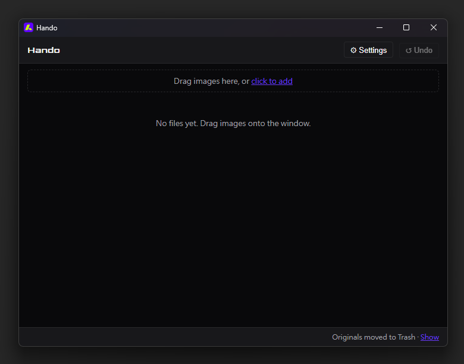

<h1> Hando</h1>

A single-file desktop image optimizer for Windows and macOS. Drag images in, get smaller files out. No installer, no Node runtime, no companion folders.

**Languages:** English · 繁體中文 · 简体中文 · 日本語 · 한국어 · Español · Português (auto-detected, switchable in Settings)

## Features

- **Drag-and-drop** — drop images onto the window or click to browse
- **JPEG, PNG, WebP, AVIF** — all four formats supported for both input and output
- **Auto quality mode** (default) — searches for the smallest file that still clears a perceptual quality target (ssimulacra2), with three presets: visually lossless / balanced / aggressive. Already-compressed sources get a generation-loss guard instead of being blindly re-crunched. Manual per-format sliders are one click away
- **Color & metadata control** — ICC color profiles pass through by default so wide-gamut photos don't shift; EXIF (capture time, GPS, …) is stripped by default for privacy, with a keep option. AVIF output can't carry either yet (encoder limitation)
- **Never makes things worse** — skips the file when savings are negligible; JPEGs get a lossless DCT-transcode second chance before being skipped
- **Undo** — one-click restore; originals are moved to Trash, not deleted
- **Optional companion output** — export WebP or AVIF alongside the original format
- **Portable** — single executable, no installation required

## Demo



## Download

Pre-built binaries are published in [Releases](../../releases). Single executable; double-click to launch.

| Platform | File |
|---|---|
| Windows x64 | `Hando-win-x64-v*.exe` |
| macOS Universal | `Hando-mac-universal-v*.app.zip` |

### macOS first launch

Hando is currently distributed without an Apple Developer ID signature, so on first launch macOS Gatekeeper will refuse to open it with: *"Apple cannot verify that 'Hando' is free of malicious software..."*

To allow it, run the following once in **Terminal**:

```bash
xattr -cr /path/to/Hando.app
```

Replace `/path/to/Hando.app` with the actual location, e.g. `~/Downloads/Hando.app` or `/Applications/Hando.app`. After this, double-click works as normal.

> **中文：** 由於 Hando 目前未通過 Apple 公證，首次開啟會出現「Apple 無法驗證『Hando』是否為惡意軟體」警告。請在「終端機」執行 `xattr -cr /Hando.app 的路徑`（例如 `~/Downloads/Hando.app`），之後即可正常使用。
>
> Apple Developer Program 收費 $99 美金/年。若你願意贊助以支援未來正式公證，請參考下方 [Sponsor](#sponsor) 區塊。

## Build from source

### Prerequisites

- **Rust** stable, ≥ 1.85.1
- **Node.js** 20+ (only for the desktop frontend dev server — not bundled into the app)
- Platform toolchain:
  - **Windows**: Visual Studio 2022 Build Tools (Desktop development with C++, includes CMake) + **NASM 2.15.05** (`winget install NASM.NASM --version 2.15.05`) + a `perl` on PATH (the one bundled with Git for Windows works: `<Git>\usr\bin`)
    - **Important**: Run `cargo` commands from the *"x64 Native Tools Command Prompt for VS 2022"* shell, or first invoke `vcvarsall.bat x64`. Otherwise `mozjpeg-sys` and `webp-sys` linker steps will fail with cryptic errors.
  - **macOS**: Xcode Command Line Tools (`xcode-select --install`) + **NASM 2.15.05**
  - **NASM must be 2.15.05** on both platforms — `libaom-sys`'s CMake probe rejects newer NASM releases with *"Unsupported nasm: multipass optimization not supported"* (this is why CI builds 2.15.05 from source)

### Commands

```bash
npm install              # frontend deps
npm run tauri dev        # dev mode (Vite + Tauri)
npm run tauri build      # release build
npm run dist             # release build + rename + zip
```

Outputs land in `dist-final/`.

## Architecture

See [`docs/superpowers/specs/2026-04-25-rust-native-encoder-design.md`](docs/superpowers/specs/2026-04-25-rust-native-encoder-design.md) for the full design.

Briefly:
- WebView (TypeScript + Vite) for UI
- Tauri 2 (Rust) host
- In-process Rust encoders: `mozjpeg`, `oxipng`, `imagequant`, `webp`, `ravif`
- No sidecars, no native runtime dependencies

## Release process

1. Run the pre-release smoke test: `cargo test -- --ignored` (preset gates across representative fixtures).
2. Bump version in `src-tauri/Cargo.toml` (+ `Cargo.lock`) and `src-tauri/tauri.conf.json`; date the `[Unreleased]` section in `CHANGELOG.md`.
3. Commit and tag: `git tag v0.2.1 && git push origin v0.2.1`.
4. GitHub Actions builds Windows + macOS-universal artifacts and creates a draft release.
5. Edit the draft release notes, then publish.

## Sponsor

Hando is open source and free. If it saved you time, a small tip helps cover Apple Developer Program fees ($99/year) so future builds can be properly signed and notarized — removing the macOS Gatekeeper warning for everyone.

[](https://ko-fi.com/homershie)

## License

Copyright (C) 2026 謝昇運 (homershie) <homerxworkshop@gmail.com>

This program is free software: you can redistribute it and/or modify it under the terms of the **GNU Affero General Public License v3.0 or later** (AGPL-3.0-or-later) as published by the Free Software Foundation. See [`LICENSE`](./LICENSE) for the full text.

AGPL's network clause means anyone who runs a modified version as a network service must also make their source available to users of that service. If that is incompatible with your use case, please open an issue to discuss commercial licensing.

### Third-party components

- [mozjpeg](https://github.com/mozilla/mozjpeg) — IJG (BSD-style)
- [oxipng](https://github.com/shssoichiro/oxipng) — MIT
- [imagequant](https://github.com/ImageOptim/libimagequant) — GPL-3.0 / commercial dual-licensed
- [libwebp](https://chromium.googlesource.com/webm/libwebp) — BSD-3-Clause
- [ravif / rav1e](https://github.com/xiph/rav1e) — BSD-2-Clause
- [Tauri](https://tauri.app) — MIT / Apache-2.0
- [trash (Rust crate)](https://crates.io/crates/trash) — MIT

`imagequant` is GPL-3.0; combining it with our AGPL-3.0-or-later codebase is permitted because AGPL-3.0 is a strict superset of GPL-3.0's obligations. The other dependencies' permissive licenses are AGPL-compatible as downstream components.
